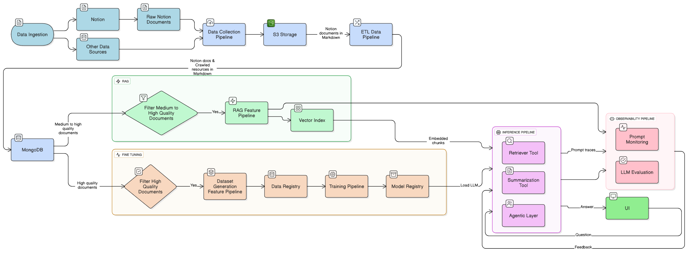

# 🧠 Antahkarana: Your Second Brain AI Assistant



Antahkarana(The Inner Instrument) is one of my dear projects that is a personal AI second brain assistant on top of your digital resources. It leverages advanced GenAI concepts, including Retrieval-Augmented Generation (RAG), fine-tuning, and LLMOps, to create a production-ready application.

## 🚀 Features

  - **Data Ingestion**: Automates the collection and processing of data from Notion and other web resources.
  - **RAG System**: Implements an advanced RAG pipeline for efficient and accurate information retrieval.
  - **LLM Fine-Tuning**: Fine-tunes an open-source LLM for specialized summarization tasks.
  - **Modular Architecture**: Built on the **Feature/Training/Inference (FTI)** architecture for scalable and maintainable MLOps.
  - **Observability**: Integrates monitoring and evaluation to track performance and prevent hallucinations.

## 📁 Project Structure

```bash
.
├── configs/                   # ZenML configuration files
├── pipelines/                 # ZenML ML pipeline definitions
├── src/second_brain_offline/  # Main package directory
│   ├── application/           # Application layer
│   ├── domain/                # Domain layer
│   ├── infrastructure/        # Infrastructure layer
│   ├── config.py              # Configuration settings
│   └── utils.py               # Utility functions
├── steps/                     # ZenML pipeline steps
├── tests/                     # Test files
├── tools/                     # Entrypoint scripts that use the python package
├── .env.example               # Environment variables template
├── .python-version            # Python version specification
├── Makefile                   # Project commands
└── pyproject.toml             # Project dependencies
```

## 🛠️ Technology Stack

  - **Orchestration**: ZenML
  - **Data Stores**: MongoDB, S3
  - **Vector Search**: MongoDB Atlas Vector Search
  - **LLMs**: Llama (Fine-tuned)
  - **Deployment**: Hugging Face Dedicated Endpoints
  - **Observability**: Opik
  - **Core Libraries**: PyTorch, Hugging Face `transformers`

